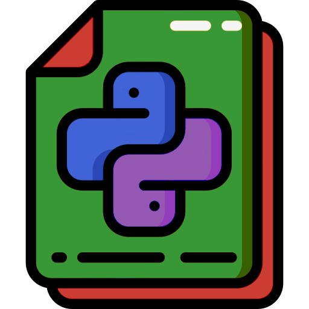

```@meta
DocTestSetup = quote
    using PyCallJLD2, Dates
end
```

```@raw html

```

# PyCallJLD2.jl

---

These pages serve as the official documentation for the `PyCallJLD2.jl` Julia package.

The purpose of this package is to provide an interface for saving [`PyCall.PyObject`](https://github.com/JuliaPy/PyCall.jl)s with [`JLD2`](https://github.com/JuliaIO/JLD2.jl).
Please see the [Package Guide](@ref package-guide) for usage, and check out the [Examples](@ref examples) page to see this usage in action with `PyCall.jl` and `ScikitLearn.jl`.

If you wish to contribute to the project, please see the [Contributing](@ref) guide.
The public API is listed in the [Index](@ref main-index), while the internal API is listed in the [Developer Index](@ref dev-main-index).

This project is heavily inspired by [`PyCallJLD`](https://github.com/JuliaPy/PyCallJLD.jl).

## Manual Outline

This documentation is split into the following sections:

```@contents
Pages = [
    "man/guide.md",
    "../examples/index.md",
    "man/contributing.md",
    "man/full-index.md",
    "man/dev-index.md"
]
Depth = 1
```

## [Attribution](@id attribution)

### Authors

This package is developed and maintained by [Sasha Petrenko](https://github.com/AP6YC) with sponsorship by the [Applied Computational Intelligence Laboratory (ACIL)](https://acil.mst.edu/).

If you simply have suggestions for improvement, Sasha Petrenko (<petrenkos@mst.edu>) is the current developer and maintainer of the `PyCallJLD2` package, so please feel free to reach out with thoughts and questions.

### Package

This package is heavily based upon the [`PyCallJLD.jl`](https://github.com/JuliaPy/PyCallJLD.jl) package; the funky-monkey-wrenching of PyCall `ccall`s, pointers, and other low-level tomfoolery would have been arcane and indecipherable without this prior work.
This package merely modifies its internal usage to match the modified [`JLD2`](https://github.com/JuliaIO/JLD2.jl) API for custom serialization.

### Icons

The icon used for the project logo is from the following:

- [Python file icons created by Smashicons](https://www.flaticon.com/free-icons/python-file) ([file_2570575](https://www.flaticon.com/free-icon/file_2570575))

### Funding

This research was sponsored by the Army Research Laboratory and was accomplished under Cooperative Agreement Number W911NF-22-2-0209.
The views and conclusions contained in this document are those of the authors and should not be interpreted as representing the official policies, either expressed or implied, of the Army Research Laboratory or the U.S. Government.
The U.S. Government is authorized to reproduce and distribute reprints for Government purposes notwithstanding any copyright notation herein.

## Documentation Build

This documentation was built using [Documenter.jl](https://github.com/JuliaDocs/Documenter.jl) with the following version and OS:

```@example
using PyCallJLD2, Dates # hide
println("PyCallJLD2 v$(PYCALLJLD2_VERSION) docs built $(Dates.now()) with Julia $(VERSION) on $(Sys.KERNEL)") # hide
```
